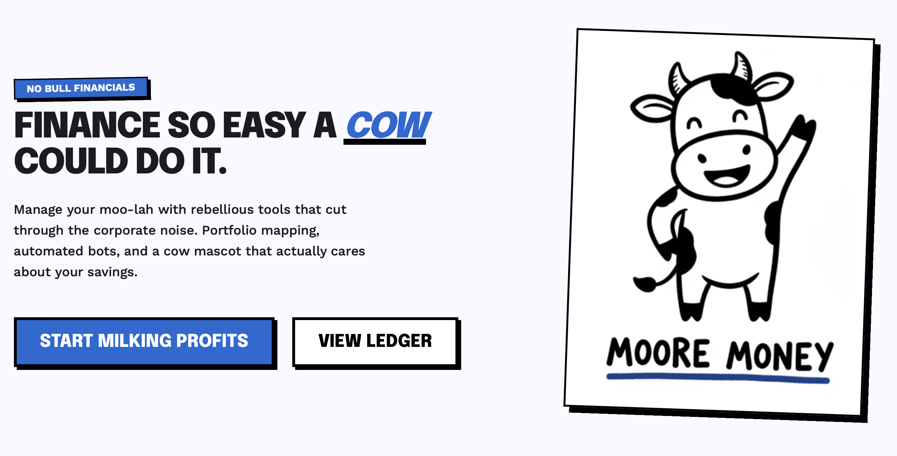
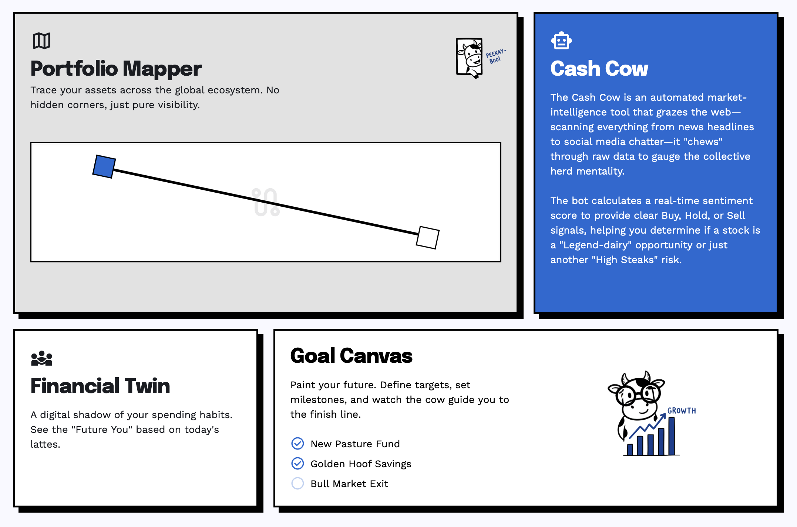

# Moore Money 🐮

> **"Finance so easy a cow could do it."**

### 🏆 First place submission to Goldman Sachs' AI Hackathon

<!---->

Moore Money is a next-generation AI-powered wealth management and financial tracking platform built for the everyday retail investor. Designed with a unique **"Doodle Neobrutalist"** aesthetic to cut through corporate intimidation, Moore Money brings institutional-grade analytics, ecosystem risk mapping, and interactive scenario planning into an accessible, visually striking experience.

[▶️ Watch our demo here on Moo-tube ↗](https://youtu.be/-SbBAWQm7zY)

---



## 🌟 Key Features

1. **Portfolio Mapper & Ecosystem Risk Scanner**
   - Trace your assets across the global ecosystem.
   - Leverages **Google Gemini** (or local fallbacks) to dynamically map out top supplier dependencies and competitor risks for any given stock ticker.
   - Reveals "hidden exposures" in your portfolio before they become problems.

2. **Cash Cow (Market Intelligence Bot)**
   - An automated NLP sentiment-analysis bot that grazes the web (Reddit's financial subreddits like r/wallstreetbets, r/investing, etc.) to gauge the herd mentality.
   - Calculates a real-time sentiment score combined with **HFRP (Fundamental Risk)** and base risk to output clear **Buy, Hold, or Sell** signals.

3. **Goal Canvas**
   - Visually map your financial journey using an interactive, drag-and-drop directed graph interface.
   - Powered by Gemini, you can type a natural language prompt (e.g., "I want to buy a house in 5 years") and generate a node-based roadmap of actionable steps.
   - Click any node to dynamically refine and "rebalance" your path.

4. **Financial Twin**
   - A digital shadow timeline forecasting your portfolio's growth over 30 years.
   - Compare your "Status Quo" portfolio against an "Optimized/Rebalanced" path under various market stress-test scenarios (e.g., Market drops 20%, Tech crash, Inflation stays high, or custom prompts).

5. **Advanced Portfolio Health Insights**
   - **Market Crash Risk (FRM):** Estimates exposure to market-wide shocks.
   - **Diversification Test:** Compares portfolio structural diversity against the S&P 500 benchmark.
   - **Fundamental Risks (HFRP):** Analyzes core financial health based on company fundamentals (Credit, Liquidity, Market, Operational).

---

## 🎨 Design System: "Doodle Neobrutalist"

Our UI removes the intimidation factor of finance by mixing the rigid structure of Neobrutalism with organic, hand-drawn sketches. 
- **Typography:** Heavy Epilogue (800+) for headings and geometric Work Sans for data.
- **Colors:** Strict high-contrast palette. Pure whites, deep blacks, and a vibrant **Primary Blue (#196ad4)**.
- **Mascot:** "Moore the Cow" acts as a functional guide throughout the app, dynamically reacting to states (Loading, Success, Empty).
- *(See `DESIGN.md` for full design guidelines)*

---

## 🛠 Tech Stack

- **Frontend:** Vanilla HTML, CSS, JavaScript + TailwindCSS (via CDN).
- **Backend:** Python (Flask).
- **APIs & Data:**
  - **Google Gemini API** (for supply chain generation, what-if coaching, and Goal Canvas logic).
  - **yfinance** (for market data and fundamentals).
  - **PRAW (Python Reddit API Wrapper)** (for real-time sentiment analysis).
  - **vaderSentiment** (for NLP scoring).
  - **NetworkX** (for portfolio adjacency mapping).
- **Visuals:** Chart.js (for analytics), SVG generation.

---

## 🚀 Running Locally

Because the frontend is served directly by our Flask backend, you only need to run one command sequence to start everything!

```bash
cd backend
npm install
python3 -m venv venv
source venv/bin/activate
pip install -r requirements.txt
python app.py
```

Once running, open your browser to [http://127.0.0.1:5000](http://127.0.0.1:5000) to view the frontend.

### Environment Variables (Optional but Recommended)

For full functionality (Gemini features, real-time Reddit scraping), configure your environment variables:

```bash
export GEMINI_API_KEY=your_gemini_api_key
export REDDIT_CLIENT_ID=your_reddit_client_id
export REDDIT_CLIENT_SECRET=your_reddit_client_secret
export FINNHUB_API_KEY=your_optional_finnhub_profile_key
```
*(You can also use a `.env` file based on `backend/.env.example`)*

**Note on Fallbacks:** If the Gemini API is missing or fails, the backend gracefully degrades to use curated local JSON fallback data so the app never breaks!

---

## 📂 Repository Structure

```text
goldmanhack2026/
├── DESIGN.md                 # UI/UX design specifications
├── README.md                 # Project documentation
├── backend/                  # Flask Backend & Services
│   ├── app.py                # Main Flask entrypoint and endpoints
│   ├── routes/               # Modular Flask blueprints (ecosystem_risk, what_if)
│   ├── services/             # Core logic (Gemini JS/Py wrappers, NLP logic)
│   ├── scripts/              # Node.js bridging scripts for Gemini calls
│   ├── data/                 # Fallback datasets
│   └── tests/                # Unit test suites
└── frontend/                 # Static Assets
    ├── index.html            # Landing Page
    ├── dashboard.html        # Portfolio & Risk Dashboard
    ├── canvas.html           # Goal Canvas Visualizer
    ├── twin.html             # Financial Twin Simulator
    ├── css/                  # Vanilla CSS
    ├── js/                   # Core JS (App interactions, Bread Bot)
    ├── assets/               # Bank logos and mock assets
    └── cowIcons/             # Mascot illustrations
```

---

## ✅ Verification & Testing

To run the backend test suite:
```bash
cd backend
source venv/bin/activate
python -m unittest discover -s tests -v
```

Test the live endpoints:
```bash
# Test the Supply Chain mapping
curl http://127.0.0.1:5000/api/supply-chain/AAPL
```

---
*Built with ❤️ for goldmanhack2026*
